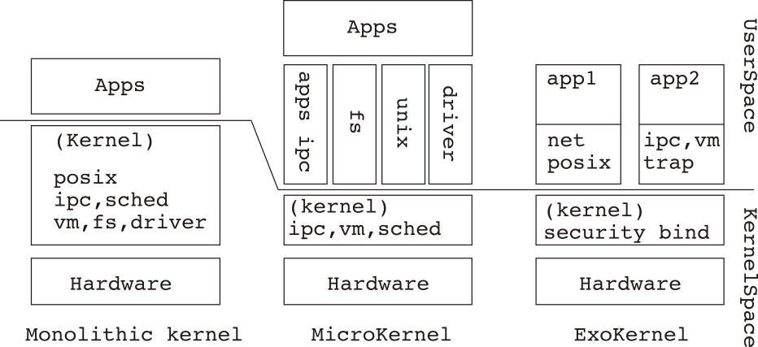

# はじめに

Markdown で論文書きたい人のためのサンプルです．
次のように Markdown の記法が使えます．

- アイテマイズ 1
- アイテマイズ 2

src ディレクトリにこの Markdown を変換した \TeX テキストファイルが出力されます．
さらにこの TeX ファイルに編集を加えてからもう一度 `make` をすると，その編集が反映されるかと思います．

# 背景

これを作ったのは次のためです．

1. 最終的に TeX を書くにしても最初に書き下すときに TeX 記法は使いたくない
2. Pandoc を使うにしても色々自動でやってくれるようにある程度体裁などの設定のラクをしたい

# 提案手法

既存の類似フレームワークは Re:VIEW\cite{review} が存在します．
また，\LaTeX だけで最初から書いてしまう，という以前より行なわれてきた手段もありますが，
\LaTeX はあくまで組版ソフトであり，文章そのものを書く環境としては煩雑であり好ましくありません．
これらを[@tbl:method]にまとめて示します．

| 手法    | メリット                                   | デメリット                         |
|---------|--------------------------------------------|------------------------------------|
| \LaTeX  | 体裁が細やかに指示できる                   | 記法が煩雑                         |
| Re:VIEW | Markdown から体裁を整えた PDF を出力できる | 独自記法を覚える必要がある         |
| 本手法  | MD から体裁を整えた PDF が作れ，構造が簡素 | 車輪の再発明になっているフシがある |

  : 手法の比較 {#tbl:method} 

## テストのテキスト

{#fig:libos}

ライブラリ OS（Library OS；LibOS） とは，OS が最低限のセキュリティバインディング API のみを持つようにし，
従来の OS がもつサブシステムを全部アプリケーションにリンクさせるライブラリにしたものである\cite{Engler1995}．

モノリシックカーネル，マイクロカーネル，エクソカーネル（LibOS）の変遷を[@fig:libos]に示す．

# まとめ

良い執筆生活を！
